# 🧮 AI Math Solver & Scan Assistant

  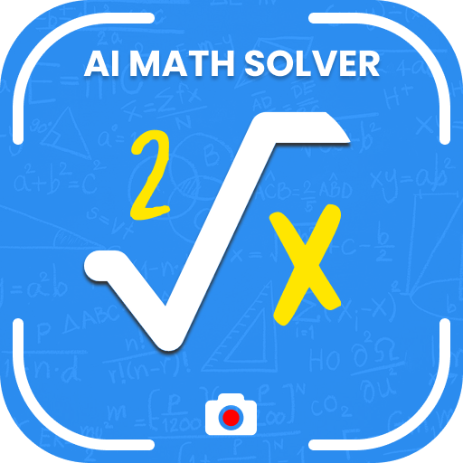

  

  

This is a premium, high-performance Android mobile application that I architected and developed **completely from scratch** during my time at **Zeesoft Tech**. 

Designed to act as a personal AI-powered math tutor, this application solves a fundamental educational challenge: converting complex math equations (both printed and handwritten) into clear, structured, and easy-to-understand solutions instantly. The product integrates advanced optical character recognition (OCR) and deep artificial intelligence solvers with a high-performance scientific calculator, helping students, parents, and teachers tackle everything from basic arithmetic to advanced calculus.

With **over 1,000+ active downloads** on the Google Play Store, the app is a powerful showcase of full-stack mobile engineering, camera-processing pipelines, and AI integration.

## 👨‍💻 My Role & Technical Contributions

As the **Lead Android Developer**, I solely architected and developed the entire application from the ground up. My key technical contributions included:

* **📸 High-Performance Camera & OCR Pipeline:** Engineered the core real-time camera scanning interface, optimizing frames capture and integrating highly accurate OCR models to recognize both handwritten and printed math equations instantly.
* **🧠 Multi-Problem Recognition Engine:** Designed and implemented a unique multi-scan feature that allows users to capture entire math worksheets in a single shot, segmenting and solving multiple equations concurrently.
* **🏗️ Ground-up App Architecture:** Developed the clean architecture foundation of the app from scratch, decoupling the AI solving APIs, local SQL database storage, and custom PDF export engines.
* **🎨 Modern UI/UX Implementation:** Built the interface following Google's **Material 3 / Material You** specifications, focusing on interactive animation transitions, clean step-by-step cards, and responsive custom dialogs.

## 🔒 Code Sharing & Intellectual Property Notice

Because this app is actively published and holds proprietary commercial value, **the source code cannot be shared publicly** under my employment and confidentiality agreements with **Zeesoft Tech**. 

I have created this repository to showcase:
* The UI/UX styling and design direction.
* The feature set and user experience workflows.
* The architectural design and product scope of what I built.

## 🚀 The Core Features I Developed

### 📸 Instant Scan & Solve (Single & Multi-Scan)
* **Real-time Detection:** Point the camera at any equation to trigger an immediate, high-accuracy AI solve without manual typing.
* **Worksheet Multi-Scanning:** I developed a revolutionary multi-problem scan option that captures multiple equations on a single page, recognizing and displaying solutions for all of them at once.

### 📚 Detailed Step-by-Step Explanations
* **Interactive Tutoring:** Instead of just outputting a simple number, the app renders comprehensive, logical steps for each equation, explaining the algebraic or calculus methods clearly so users can learn from each process.

### 🧮 Built-In Smart Calculator
* **Custom Scientific Engine:** Created an advanced calculator supporting basic operations, algebraic variables, and complex scientific symbols for typing equations directly.

### 📄 Professional PDF Export & History
* **Document Engine:** Programmed a custom utility to convert completed solutions (complete with all mathematical steps) into clean, printable PDF sheets to save, print, or share instantly.
* **Solution Archiver:** Integrated a local SQLite database that saves a full history of past scans for rapid quiz preparation and exam review.

## 📱 Subjects Covered

The AI solver supports a wide variety of mathematical disciplines:
* **Basic Mathematics:** Arithmetic, fractions, and pre-algebra.
* **Algebra:** Linear/quadratic equations, inequalities, systems of equations, and functions.
* **Calculus:** Limits, derivatives, integrals, and sequence analysis.
* **Geometry & Trigonometry:** Shapes, trigonometric identities, and proof checks.
* **Statistics:** Probability distributions, mean, median, mode, and standard deviation.

## 📱 App Screenshots

Here is a look at the final camera scanning layouts, smart calculator interfaces, and detailed step-by-step solving flows that I built:

  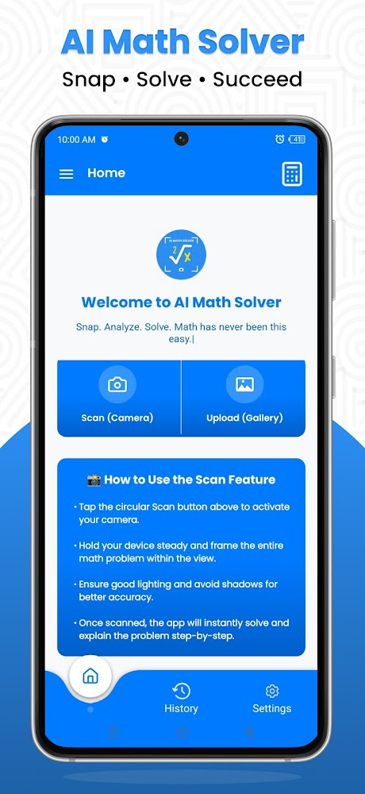
  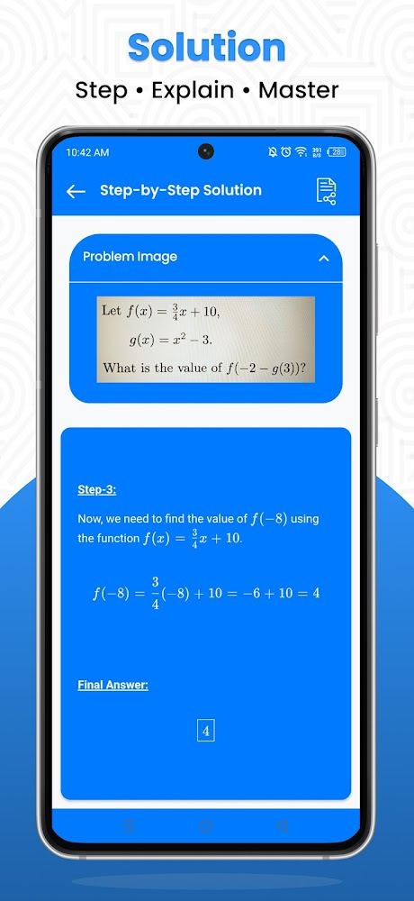
  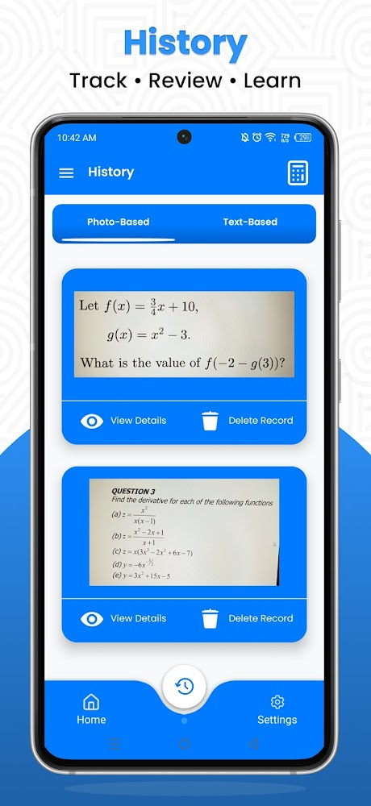

  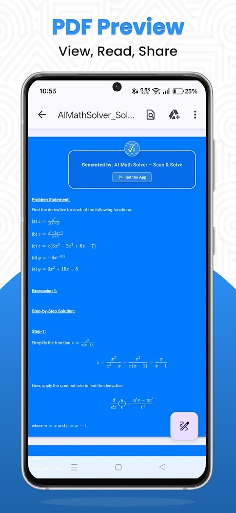
  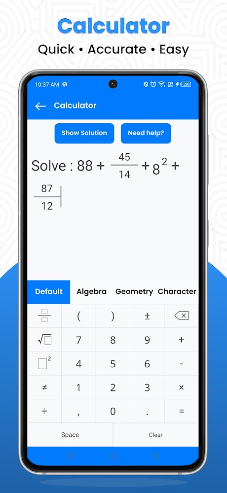
  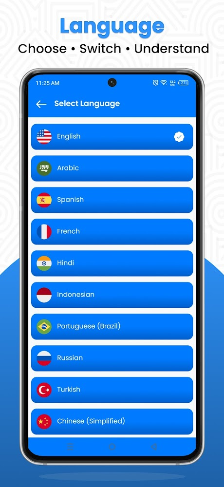

  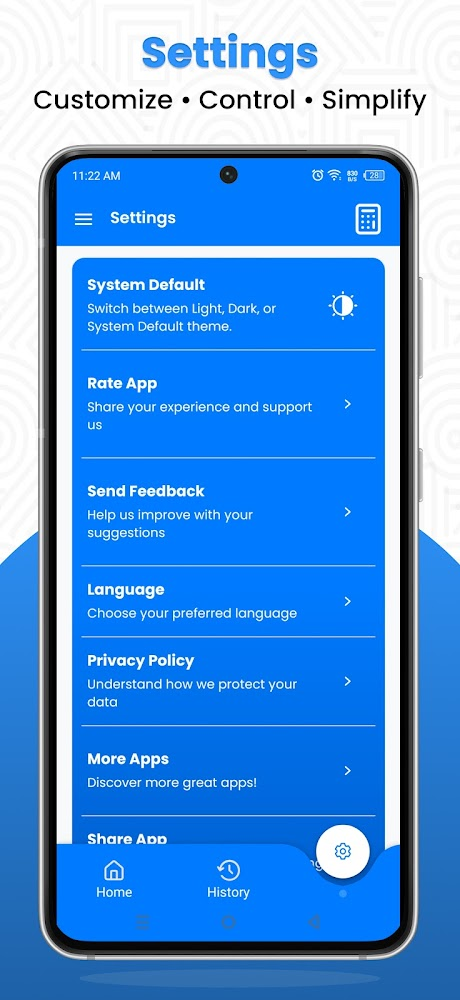
  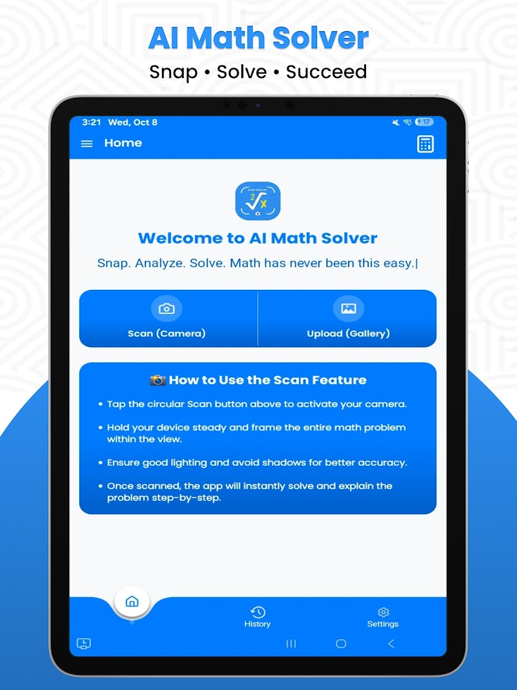
  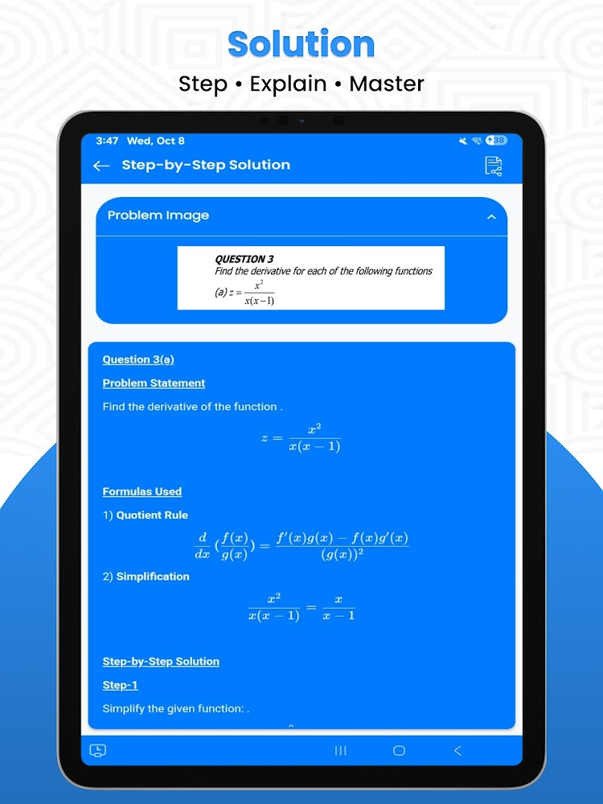

  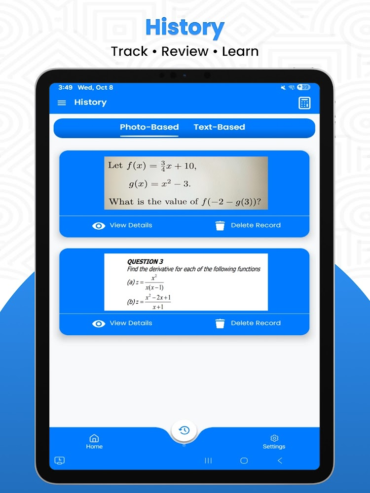
  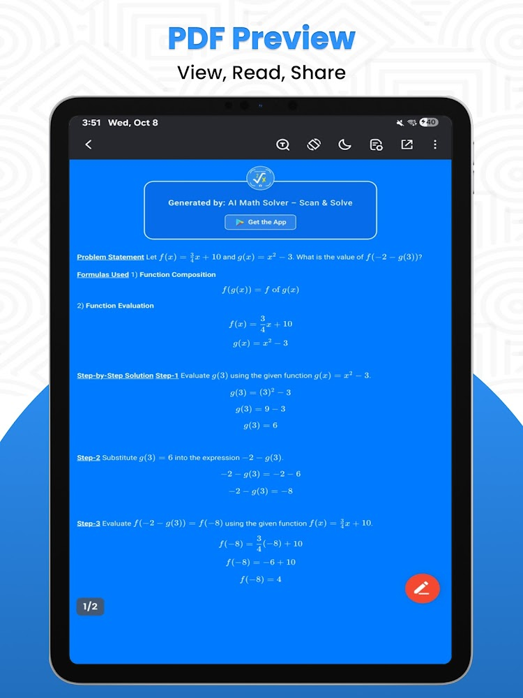
  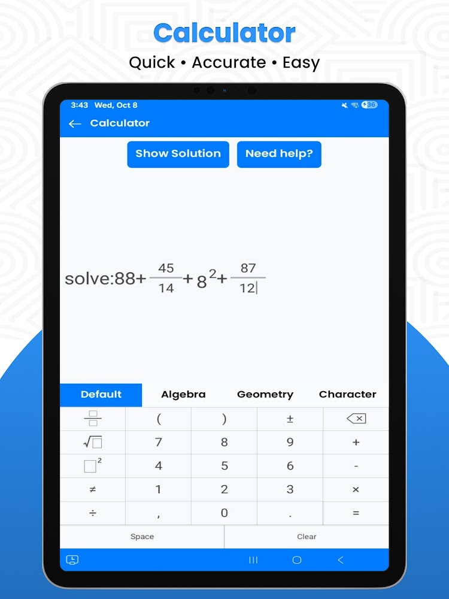

## 🏢 Project Details
* **Role:** Lead Developer (Ground-up Architecture & Full-Stack Development)
* **Company:** Zeesoft Tech
* **Availability:** Available on the Google Play Store (**1K+ Downloads**), [**Download Now**](https://play.google.com/store/apps/details?id=com.aistudy.math.scan.problemsolver&hl=en)